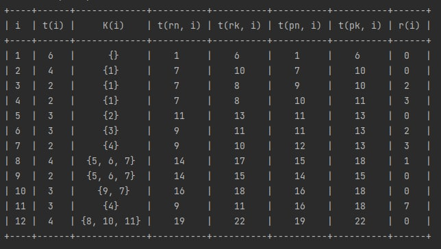

# Расчет временных характеристик сетевых моделей
Алгоритм для подсчёта временных характеристик сетевых моделей. С помощью сетевой модели моделируется процесс 
производства изделия. Для подсчёта используются алгоритм с тактами.  

## Результирующая таблица содержит данные:
- `i` - номер работы
- `t(i)` - время выполнения работы
- `K(i)` - множество работ, предшествующих работе с номером `i`
- `t(rn, i)` - время самого _раннего начала_ выполнения работы с номером `i`
- `t(rk, i)` - время самого _раннего окончания_ выполнения работы с номером `i`
- `t(pn, i)` - время самого _позднего начала_ выполнения работы с номером `i`
- `t(pk, i)` - время самого _позднего окончания_ выполнения работы с номером `i`
- `r(i)` - резерв времени работы с номером `i` (время, на которое не в ущерб времени общего окончания 
выполнения всех работ, можно задерживать выполнение работы с номером `i`)

## Использование:
1. Установите библиотеку для отображения данных в таблице:  
`pip install prettytable`
2. Запустите программу:  
`python network_model_algorithm.py`
3. Введите исходные данные: количество работ и для каждой из работ время её выполнения + множество работ, 
предшествующих ей через запятую (либо enter, если нет предшествующих работ).
4. Значение последней строки столбца `t(rk, i)` будет длиной критического пути (время выполнения всех работ для 
изготовления изделий).

## Пример результирующей таблицы:
  
